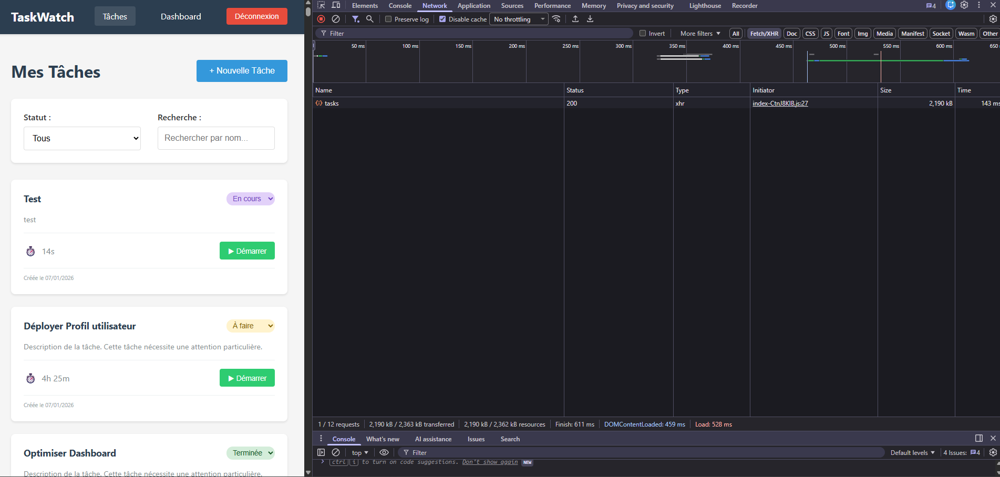
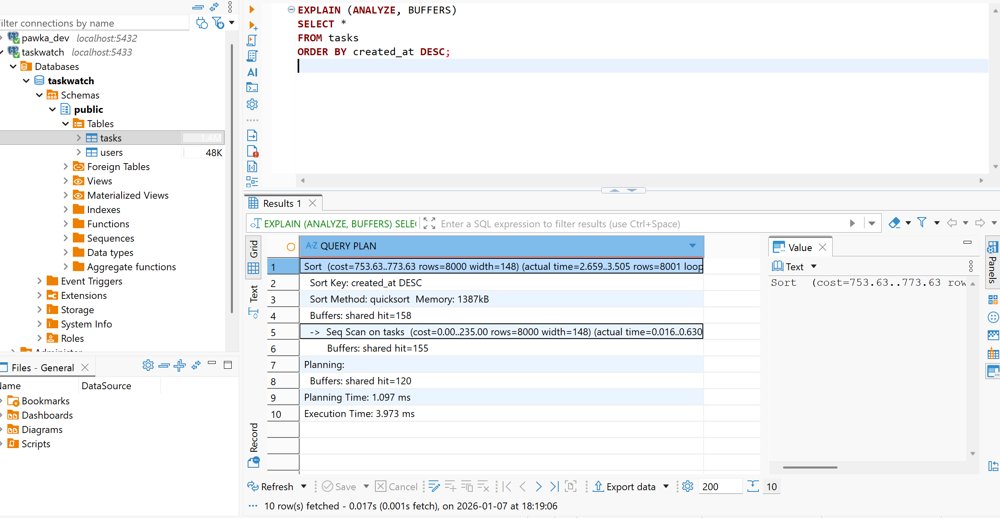
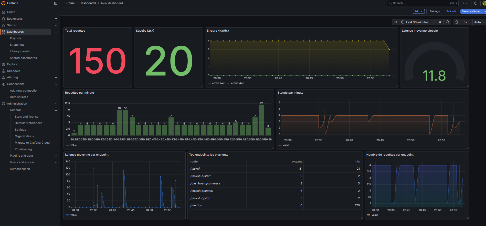

# AUDIT REPORT - TaskWatch

## 1. Introduction

Ce document présente un audit technique de l’application **TaskWatch**, réalisé dans le but d’analyser son architecture, ses performances et la qualité de son code, puis d’identifier et mettre en œuvre des optimisations ciblées et mesurées.

L’audit suit une démarche structurée en quatre étapes : identification des flux, instrumentation, analyse, puis optimisation.

---

## 2. Vue d’ensemble de l’architecture

TaskWatch repose sur une architecture web en trois couches :

- **Frontend** : application SPA développée en Vue 3
- **Backend** : API REST Node.js / Express organisée en couches (routes, controllers, services, repositories)
- **Base de données** : PostgreSQL

Flux général :
Utilisateur → Frontend → Backend → Base de données

---

## 3. Identification des flux applicatifs

Une première phase de l’audit a consisté à identifier les **principaux flux techniques et parcours utilisateurs** de l’application, afin de repérer les zones critiques à auditer en priorité.

Les flux suivants ont été identifiés :

- Authentification utilisateur
- Consultation de la liste des tâches (chargement, filtres, recherche)
- Création d’une tâche
- Mise à jour du statut d’une tâche
- Suivi du temps (démarrage et arrêt d’un timer)
- Consultation du dashboard de statistiques

L’ensemble de ces flux est illustré dans le schéma ci-dessous, représentant les échanges entre le frontend, le backend et la base de données.


---

## 4. Conclusion de la phase d’identification

Cette cartographie met en évidence plusieurs flux centraux fortement sollicités, en particulier les opérations de listing et d’agrégation de données.  
Ces flux constituent des **points d’attention prioritaires** pour la suite de l’audit, notamment en termes de performance, de volumétrie et de complexité des traitements.

Ils serviront de base pour la mise en place des indicateurs, la collecte de métriques et le diagnostic détaillé présentés dans les sections suivantes.

---

## 5. Analyse des performances frontend – Lighthouse

Une première analyse des performances frontend a été réalisée à l’aide de **Lighthouse (Chrome DevTools)**, afin d’obtenir une **mesure initiale (baseline)** avant toute optimisation.


---

### 5.1 Page "Liste des tâches"


La page principale de l’application (liste des tâches) présente un **score de performance moyen (54/100)**, révélant plusieurs points de friction côté frontend.

**Principales métriques observées :**
- First Contentful Paint (FCP) : **0,4 s** (bon)
- Largest Contentful Paint (LCP) : **2,6 s** (dégradé)
- Total Blocking Time (TBT) : **4 530 ms** (très élevé)
- Speed Index : **1,3 s**
- Cumulative Layout Shift (CLS) : **0** (stable)

**Analyse :**
- Le FCP rapide indique que le premier rendu visuel est correct.
- En revanche, le **temps de blocage très élevé (TBT)** met en évidence une forte charge sur le **thread principal JavaScript**.
- Lighthouse signale :
  - un temps d’exécution JavaScript important,
  - des tâches longues bloquant le rendu,
  - du JavaScript inutilisé,
  - un DOM potentiellement trop volumineux.

Ces éléments suggèrent que la page exécute **trop de logique côté frontend lors du chargement**, probablement liée au rendu de la liste de tâches, aux traitements de données et aux re-renders.

---

### 5.2 Page "Dashboard"


À l’inverse, la page Dashboard affiche un **excellent score de performance (100/100)**.

**Principales métriques observées :**
- First Contentful Paint (FCP) : **0,4 s**
- Largest Contentful Paint (LCP) : **0,5 s**
- Total Blocking Time (TBT) : **0 ms**
- Speed Index : **0,4 s**
- Cumulative Layout Shift (CLS) : **0**

**Analyse :**
- Le rendu est rapide et fluide.
- Aucun blocage du thread principal n’est détecté.
- La structure de la page, plus synthétique et moins volumineuse, limite naturellement les coûts de rendu et d’exécution JavaScript.

---

### 5.3 Comparaison et premiers constats

La comparaison entre les deux pages met en évidence un **écart significatif de performance** :

- La page *Dashboard* est légère, bien structurée et performante.
- La page *Liste des tâches* concentre l’essentiel des problèmes de performance frontend.

**Hypothèses initiales :**
- Rendu d’un grand nombre de composants (liste volumineuse).
- Re-renders excessifs de composants Vue.
- Traitements JavaScript synchrones coûteux lors du chargement.
- Absence de pagination ou de limitation côté frontend.

Ces constats orientent la suite de l’audit vers une analyse plus fine via **DevTools (Network, Performance, Vue DevTools)**, afin d’identifier précisément les causes racines et de cibler les optimisations les plus pertinentes.

---

## 6. Analyse des performances frontend – DevTools Performance

Afin de compléter l’analyse Lighthouse et d’identifier plus précisément les causes des problèmes de performance, une analyse a été réalisée à l’aide de l’onglet **Performance** des Chrome DevTools, sur les pages *Liste des tâches* et *Dashboard*.

Les enregistrements ont été effectués lors du chargement initial de chaque page.

---

### 6.1 Page "Liste des tâches"

L’enregistrement de la page *Liste des tâches* met en évidence une **charge importante sur le thread principal JavaScript**.


**Observations principales :**
- Temps total d’enregistrement : ~9 s
- Temps de scripting élevé (≈ 4,2 s)
- Temps de rendering non négligeable (≈ 1,2 s)
- Présence de nombreuses **long tasks** (supérieures à 50 ms)
- Exécution JavaScript concentrée autour du chargement initial

**Analyse :**
- La timeline montre que le chargement des données (XHR) est suivi de longues phases de calcul JavaScript et de re-rendu.
- Ces traitements bloquent le thread principal, ce qui explique le **Total Blocking Time élevé observé dans Lighthouse**.
- Le rendu de la liste de tâches semble entraîner des recalculs de style et de layout successifs, probablement dus à :
  - un nombre élevé de composants affichés simultanément,
  - des re-renders excessifs,
  - des traitements synchrones sur les données côté frontend.

Ces éléments indiquent que la principale source de dégradation des performances sur cette page est **le coût du rendu et du traitement frontend**, plus que le chargement réseau lui-même.

---

### 6.2 Page "Dashboard"

À l’inverse, l’enregistrement de la page *Dashboard* montre un comportement nettement plus performant.


**Observations principales :**
- Temps total d’enregistrement : ~1,8 s
- Temps de scripting limité (≈ 230 ms)
- Rendering quasi instantané
- Absence de long tasks significatives
- Rendu rapide et stable de l’interface

**Analyse :**
- Le volume de données affichées est plus faible.
- Les composants sont moins nombreux et moins complexes.
- Les traitements JavaScript sont courts et non bloquants.

Ces éléments expliquent le **score Lighthouse maximal** observé sur cette page.

---

### 6.3 Comparaison et diagnostic frontend

La comparaison des deux enregistrements confirme les constats issus de Lighthouse :

- La page *Liste des tâches* concentre l’essentiel des problèmes de performance frontend.
- Le problème principal n’est pas lié au réseau mais à :
  - l’exécution JavaScript,
  - la complexité du rendu,
  - la gestion des composants et des états.

**Diagnostic initial :**
- Sur-rendu et/ou re-renders excessifs de la liste de tâches.
- Traitements synchrones coûteux sur le thread principal.
- Absence de mécanismes de limitation (pagination, virtualisation, découpage de composants).

Ces constats orientent les prochaines étapes de l’audit vers :
- une analyse Network ciblée des appels API,
- une inspection des composants Vue impliqués,
- et des optimisations frontend visant à réduire la charge de rendu et les re-renders inutiles.

---
## 7. Analyse des performances réseau – DevTools Network

Une analyse des requêtes réseau a été réalisée sur la page *Liste des tâches* à l’aide de l’onglet **Network** des Chrome DevTools, en filtrant les appels XHR et en désactivant le cache.



**Observations :**
- Une seule requête API est déclenchée lors du chargement initial : `GET /tasks`.
- La requête retourne un statut 200 et un temps de réponse d’environ 143 ms, indiquant une bonne performance côté backend.
- En revanche, la taille de la réponse est très élevée (≈ 2,2 MB).

**Analyse :**
- L’absence de multiples appels API exclut un problème de sur-sollicitation du backend.
- Le temps de réponse faible confirme que la latence réseau et les performances serveur ne sont pas le facteur limitant.
- Le volume important de données transférées implique un coût significatif côté frontend pour :
  - le parsing du JSON,
  - le rendu d’un grand nombre de composants,
  - les recalculs de layout et de style.

Ces éléments confirment que les problèmes de performance observés sur la page Liste des tâches sont principalement liés à la gestion du volume de données et au rendu frontend, et non à la latence des appels API.

---

### Diagnostic intermédiaire

Sur la base des analyses Lighthouse, Performance et Network, on peut constater :
- l’absence de mécanismes de limitation des données (pagination, filtrage côté backend),
- combinée à un rendu frontend coûteux sur la page de liste des tâches.

Ces constats orientent naturellement les optimisations à venir vers :
- la réduction du volume de données retournées par l’API,
- et l’optimisation du rendu et des composants frontend.

---

## 8. Analyse base de données - EXPLAIN ANALYZE sur la requête de listing

La page "Liste des tâches" repose sur la requête suivante :

```sql
SELECT *
FROM tasks
ORDER BY created_at DESC;
```
Un EXPLAIN (ANALYZE, BUFFERS) a été réalisé afin d’analyser le plan d’exécution et d’identifier les coûts associés.



#### Résultats principaux :

- Lecture de la table via un Seq Scan (scan séquentiel complet).
- Tri explicite sur created_at DESC effectué en mémoire (Sort Method: quicksort).
- Environ 8000 lignes retournées.
- Temps d’exécution faible (~4 ms), avec des buffers majoritairement en cache (shared hit).

#### Impact global :

- La requête renvoie l’intégralité des tâches, ce qui entraîne un volume de données très important transféré vers le frontend.
- Ce volume provoque un coût élevé de parsing JSON et de rendu côté frontend, confirmé par les métriques Lighthouse et DevTools (TBT élevé, long tasks).

---

## 9. Points sensibles identifiés et priorisation

Sur la base des analyses réalisées (Lighthouse, DevTools Performance & Network, EXPLAIN ANALYZE), plusieurs points sensibles ont été identifiés et priorisés selon leur impact.

### P1 – Performance de la page "Liste des tâches"
**Priorité : élevée**

- Score Lighthouse faible (54/100).
- Total Blocking Time très élevé (> 4 s).
- Nombre important de long tasks côté frontend.

**Preuves :**
- Lighthouse (section 5.1)
- DevTools Performance (section 6.1)

---

### P1 – Volume de données retournées par l’API `/tasks`
**Priorité : élevée**

- Payload réseau très important (~2,2 MB).
- Une seule requête API, mais renvoyant l’intégralité des tâches.

**Preuves :**
- DevTools Network (section 7)
- Corrélation directe avec le TBT élevé.

---

### P2 – Requête SQL de listing non scalable
**Priorité : moyenne**

- Scan séquentiel complet de la table.
- Tri en mémoire sur `created_at`.
- Absence de pagination et d’index exploité.

**Preuves :**
- EXPLAIN (ANALYZE, BUFFERS) (section 8)

---

### P3 – Absence de mécanismes de limitation et de cache
**Priorité : moyenne**

- Aucune pagination par défaut.
- Avertissements Lighthouse sur la gestion du cache des ressources.

**Preuves :**
- Lighthouse (section 5)

---

## 10. Indicateurs de diagnostic : quoi mesurer, où et comment

Afin de piloter le diagnostic et d’évaluer l’impact des optimisations futures, plusieurs indicateurs ont été identifiés.

### Indicateurs frontend
- First Contentful Paint (FCP)
- Largest Contentful Paint (LCP)
- Total Blocking Time (TBT)
- Nombre et durée des long tasks

**Outils :**
- Lighthouse
- Chrome DevTools (Performance)

---

### Indicateurs réseau / API
- Temps de réponse par endpoint
- Taille des réponses (payload)
- Nombre d’appels API

**Outils :**
- Chrome DevTools (Network)

---

### Indicateurs base de données
- Type de scan (Seq Scan / Index Scan)
- Temps d’exécution des requêtes
- Nombre de lignes retournées
- Buffers utilisés (cache / disque)

**Outils :**
- EXPLAIN (ANALYZE, BUFFERS)
- DBeaver / PostgreSQL

---

## 11. Audit de la qualité du code et de l’architecture

### Observations backend

1. **Utilisation de `SELECT *`**
   - Retourne toutes les colonnes, même celles non utilisées par le frontend.
   - Impact direct sur la taille des réponses API.

2. **Absence de pagination côté backend**
   - Toutes les tâches sont renvoyées en une seule requête.
   - Risque important de dégradation des performances avec la montée en charge.

3. **Requête SQL de listing centralisée**
   - La logique de récupération des tâches est simple mais peu évolutive.
   - Manque de mécanismes pour limiter ou segmenter les données.

---

### Observations frontend

1. **Rendu volumineux de la liste des tâches**
   - Grand nombre de composants affichés simultanément.
   - Coût élevé en rendering et recalculs de layout.

2. **Charge JavaScript importante au chargement**
   - Traitements synchrones visibles dans la timeline Performance.
   - Blocage du thread principal (TBT élevé).

3. **Couplage fort entre chargement des données et rendu**
   - Le rendu dépend directement du volume de données retourné par l’API.
   - Absence de mécanismes de limitation ou de rendu progressif.

---

## 12. Synthèse intermédiaire

L’audit met en évidence que les principaux problèmes de performance ne sont pas liés à la latence réseau ou aux performances immédiates de la base de données, mais principalement :

- au volume de données retournées par l’API,
- au coût du rendu frontend,
- et à l’absence de mécanismes de limitation (pagination, sélection de champs).

Ces constats serviront de base pour la phase suivante, dédiée à la mise en place d’outils de suivi (monitoring) et aux optimisations applicatives.

---

## 13. Instrumentation et monitoring backend (Grafana)

Afin de compléter l’audit de performance, une instrumentation backend a été mise en place à l’aide de Grafana, basée sur des métriques HTTP collectées au niveau de l’API.



Le dashboard permet de visualiser en temps réel :

- le volume global de requêtes,
- la répartition des statuts HTTP (succès, erreurs 4xx/5xx),
- la latence moyenne globale,
- la latence moyenne par endpoint,
- le nombre de requêtes par minute,
- les endpoints les plus sollicités et les plus lents.

Cette instrumentation fournit une vision claire du comportement réel de l’API sous charge utilisateur.

---

### Analyse des métriques observées

Les métriques collectées mettent en évidence les éléments suivants :

- Le backend présente une **latence moyenne faible** (≈ 10–15 ms), indiquant de bonnes performances serveur.
- Les endpoints les plus sollicités sont principalement liés au listing des tâches (`/tasks`), ce qui correspond aux parcours utilisateurs identifiés précédemment.
- Aucun pic significatif d’erreurs 5xx n’est observé, ce qui indique une bonne stabilité de l’API.
- Le volume de requêtes reste modéré et stable durant les tests.

Ces observations confirment que :
- le backend n’est pas le facteur limitant principal des performances,
- les problèmes perçus côté utilisateur sont davantage liés au **volume de données retournées** et au **coût de rendu frontend**, comme observé lors des analyses Lighthouse et DevTools.


-----
## 14. Améliorations envisagées suite à l’audit

Objectif : réduire le volume renvoyé par défaut, améliorer la scalabilité des requêtes, et diminuer le coût de rendu côté frontend (constaté via Lighthouse/DevTools), tout en conservant une observabilité simple via Grafana.


### 14.1 Backend (API)

1. **Pagination obligatoire sur `/tasks`** (ex: `?limit=50&offset=0` ou cursor)
    
    → Évite de renvoyer ~8000 tâches et réduit fortement payload + parsing côté frontend.
    
2. **Limiter la réponse par défaut** (`limit` + tri explicite côté API)
    
    → Évite les “gros chargements” accidentels, rend le comportement prévisible.
    
3. **Remplacer `SELECT *` par une sélection de colonnes utiles** (ex: id, name, status, created_at, time_logged)
    
    → Réduit la taille de réponse et accélère le transfert + le traitement.
    
4. **Endpoint dédié “summary” / “counts”** (ex: `/tasks/summary` : totals par statut, temps total)
    
    → Évite d’utiliser un listing complet pour des stats (moins de données, moins de calculs).
    
5. **Cache léger sur endpoints de lecture** (ETag/Cache-Control sur `GET /tasks`, `GET /dashboard`)
    
    → Diminue le trafic réseau et les recomputations si les données changent peu.
    
6. **Garde-fous API** (limite max, ex: `limit <= 200`, et réponse d’erreur si dépassement)
    
    → Empêche les retours “géants” et protège l’API.
    
7. **Réduire le “bruit” de monitoring** (exclure `/metrics` des classements “top slow endpoints” ou le filtrer dans Grafana)
    
    → Rend les tableaux “Top endpoints” plus exploitables sur les routes métier (`/tasks`, `/dashboard/...`).
    

---

### 14.2 Base de données (PostgreSQL)

1. **Index sur `created_at`**
    
    → Améliore `ORDER BY created_at DESC`, utile avec pagination.
    
2. **Index sur `status` + éventuellement index composite `(status, created_at)`**
    
    → Accélère les filtres par statut + tri (cas courant sur la liste).
    
3. **Recherche scalable sur `ILIKE`** (option : `pg_trgm` + index GIN sur `name`)
    
    → Rend la recherche performante même avec beaucoup de lignes.
    
4. **Vérifier les requêtes “stats”** (COUNT/SUM) et indexer en fonction des usages
    
    → Évite les scans complets lors des agrégations fréquentes (dashboard).
    

---

### 14.3 Frontend (Vue)

1. **Réduire le coût de rendu initial** (ne pas afficher des milliers d’éléments d’un coup)
    
    → Diminue TBT et les long tasks constatés sur la page “Liste des tâches”.
    
2. **Virtualisation de la liste** (n’afficher que les éléments visibles)
    
    → Très efficace si la liste peut rester grande malgré la pagination.
    
3. **Réduire les re-renders** (watchers trop larges, computed coûteux, keys `v-for` stables)
    
    → Stabilise les performances lors des filtres / recherches / changements de page.
    
4. **Debounce sur la recherche** (ex: 300–500ms)
    
    → Évite une requête à chaque frappe et réduit la charge + le jitter UI.
    
5. **Chargement progressif / skeleton**
    
    → Améliore le ressenti utilisateur sans forcément changer l’API.
    

---

### 14.4 Observabilité & suivi (Grafana / logs)

1. **Conserver les métriques HTTP** (volume, latence, erreurs) comme baseline avant/après optimisations
    
    → Permet de prouver l’impact des changements (mesures objectives).
    
2. **Ajouter des percentiles (P95/P99) par route** (si pas déjà)
    
    → Détecte les lenteurs “rare mais graves” (plus utile que la moyenne seule).
    
3. **Alerting simple (optionnel)** sur taux d’erreur ou latence élevée
    
    → Utile pour montrer la logique “monitoring en production” (même en TP).