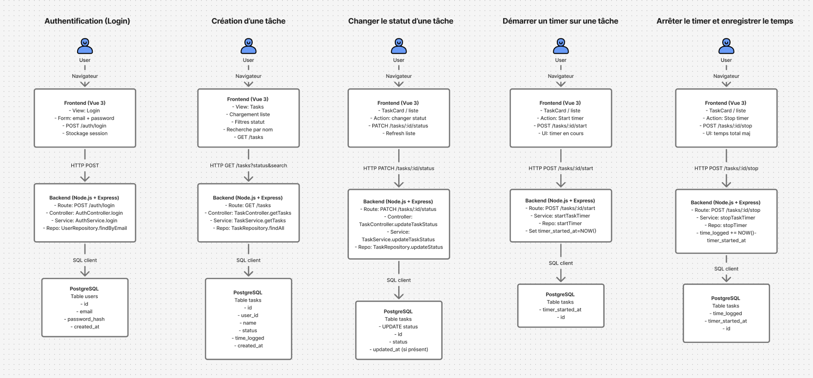
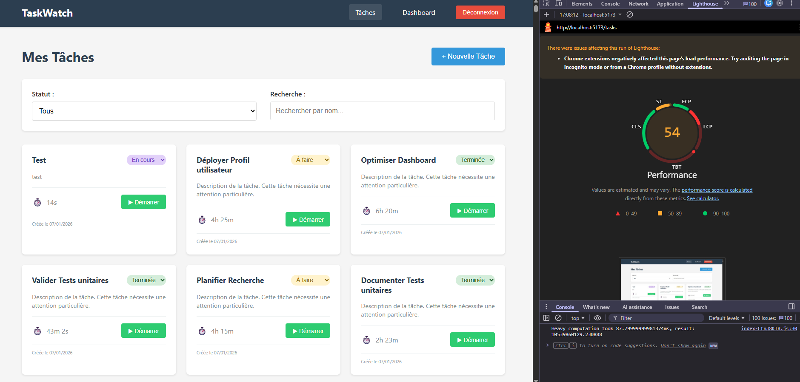
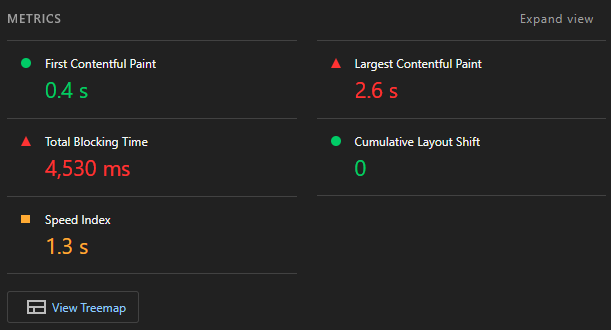
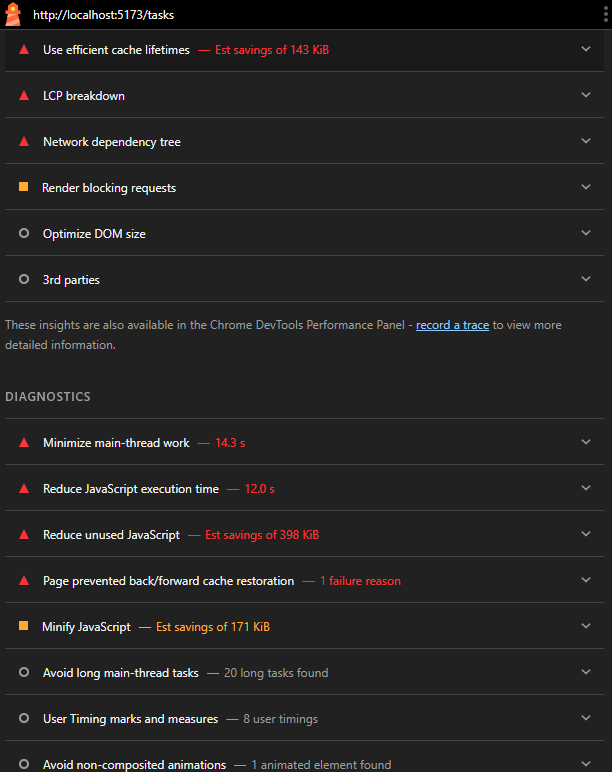
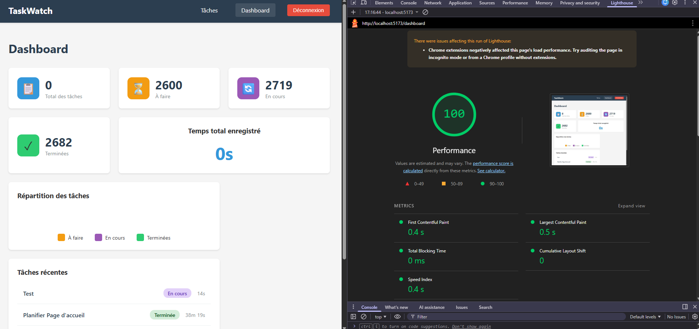
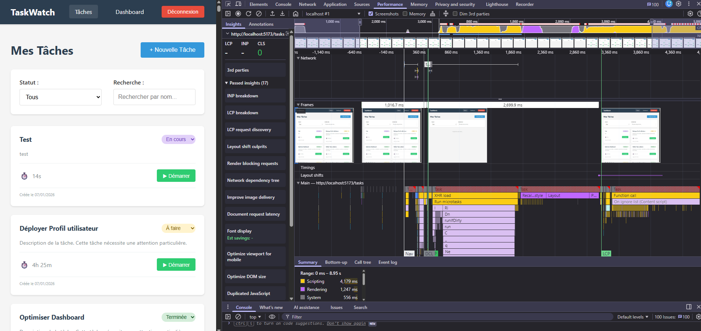
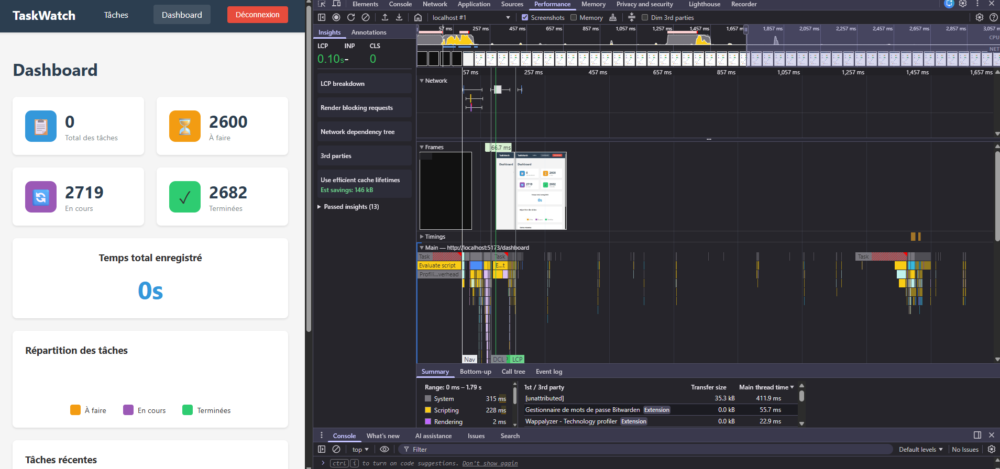

# AUDIT REPORT - TaskWatch

## 1. Introduction

Ce document présente un audit technique de l’application **TaskWatch**, réalisé dans le but d’analyser son architecture, ses performances et la qualité de son code, puis d’identifier et mettre en œuvre des optimisations ciblées et mesurées.

L’audit suit une démarche structurée en quatre étapes : identification des flux, instrumentation, analyse, puis optimisation.

---

## 2. Vue d’ensemble de l’architecture

TaskWatch repose sur une architecture web en trois couches :

- **Frontend** : application SPA développée en Vue 3
- **Backend** : API REST Node.js / Express organisée en couches (routes, controllers, services, repositories)
- **Base de données** : PostgreSQL

Flux général :
Utilisateur → Frontend → Backend → Base de données

---

## 3. Identification des flux applicatifs

Une première phase de l’audit a consisté à identifier les **principaux flux techniques et parcours utilisateurs** de l’application, afin de repérer les zones critiques à auditer en priorité.

Les flux suivants ont été identifiés :

- Authentification utilisateur
- Consultation de la liste des tâches (chargement, filtres, recherche)
- Création d’une tâche
- Mise à jour du statut d’une tâche
- Suivi du temps (démarrage et arrêt d’un timer)
- Consultation du dashboard de statistiques

L’ensemble de ces flux est illustré dans le schéma ci-dessous, représentant les échanges entre le frontend, le backend et la base de données.

---

## 4. Conclusion de la phase d’identification

Cette cartographie met en évidence plusieurs flux centraux fortement sollicités, en particulier les opérations de listing et d’agrégation de données.  
Ces flux constituent des **points d’attention prioritaires** pour la suite de l’audit, notamment en termes de performance, de volumétrie et de complexité des traitements.

Ils serviront de base pour la mise en place des indicateurs, la collecte de métriques et le diagnostic détaillé présentés dans les sections suivantes.

---

## 5. Analyse des performances frontend – Lighthouse

Une première analyse des performances frontend a été réalisée à l’aide de **Lighthouse (Chrome DevTools)**, afin d’obtenir une **mesure initiale (baseline)** avant toute optimisation.

---

### 5.1 Page "Liste des tâches"

La page principale de l’application (liste des tâches) présente un **score de performance moyen (54/100)**, révélant plusieurs points de friction côté frontend.

**Principales métriques observées :**
- First Contentful Paint (FCP) : **0,4 s** (bon)
- Largest Contentful Paint (LCP) : **2,6 s** (dégradé)
- Total Blocking Time (TBT) : **4 530 ms** (très élevé)
- Speed Index : **1,3 s**
- Cumulative Layout Shift (CLS) : **0** (stable)

**Analyse :**
- Le FCP rapide indique que le premier rendu visuel est correct.
- En revanche, le **temps de blocage très élevé (TBT)** met en évidence une forte charge sur le **thread principal JavaScript**.
- Lighthouse signale :
  - un temps d’exécution JavaScript important,
  - des tâches longues bloquant le rendu,
  - du JavaScript inutilisé,
  - un DOM potentiellement trop volumineux.

Ces éléments suggèrent que la page exécute **trop de logique côté frontend lors du chargement**, probablement liée au rendu de la liste de tâches, aux traitements de données et aux re-renders.

---

### 5.2 Page "Dashboard"

À l’inverse, la page Dashboard affiche un **excellent score de performance (100/100)**.

**Principales métriques observées :**
- First Contentful Paint (FCP) : **0,4 s**
- Largest Contentful Paint (LCP) : **0,5 s**
- Total Blocking Time (TBT) : **0 ms**
- Speed Index : **0,4 s**
- Cumulative Layout Shift (CLS) : **0**

**Analyse :**
- Le rendu est rapide et fluide.
- Aucun blocage du thread principal n’est détecté.
- La structure de la page, plus synthétique et moins volumineuse, limite naturellement les coûts de rendu et d’exécution JavaScript.

---

### 5.3 Comparaison et premiers constats

La comparaison entre les deux pages met en évidence un **écart significatif de performance** :

- La page *Dashboard* est légère, bien structurée et performante.
- La page *Liste des tâches* concentre l’essentiel des problèmes de performance frontend.

**Hypothèses initiales :**
- Rendu d’un grand nombre de composants (liste volumineuse).
- Re-renders excessifs de composants Vue.
- Traitements JavaScript synchrones coûteux lors du chargement.
- Absence de pagination ou de limitation côté frontend.

Ces constats orientent la suite de l’audit vers une analyse plus fine via **DevTools (Network, Performance, Vue DevTools)**, afin d’identifier précisément les causes racines et de cibler les optimisations les plus pertinentes.

---

## 6. Analyse des performances frontend – DevTools Performance

Afin de compléter l’analyse Lighthouse et d’identifier plus précisément les causes des problèmes de performance, une analyse a été réalisée à l’aide de l’onglet **Performance** des Chrome DevTools, sur les pages *Liste des tâches* et *Dashboard*.

Les enregistrements ont été effectués lors du chargement initial de chaque page.

---

### 6.1 Page "Liste des tâches"

L’enregistrement de la page *Liste des tâches* met en évidence une **charge importante sur le thread principal JavaScript**.

**Observations principales :**
- Temps total d’enregistrement : ~9 s
- Temps de scripting élevé (≈ 4,2 s)
- Temps de rendering non négligeable (≈ 1,2 s)
- Présence de nombreuses **long tasks** (supérieures à 50 ms)
- Exécution JavaScript concentrée autour du chargement initial

**Analyse :**
- La timeline montre que le chargement des données (XHR) est suivi de longues phases de calcul JavaScript et de re-rendu.
- Ces traitements bloquent le thread principal, ce qui explique le **Total Blocking Time élevé observé dans Lighthouse**.
- Le rendu de la liste de tâches semble entraîner des recalculs de style et de layout successifs, probablement dus à :
  - un nombre élevé de composants affichés simultanément,
  - des re-renders excessifs,
  - des traitements synchrones sur les données côté frontend.

Ces éléments indiquent que la principale source de dégradation des performances sur cette page est **le coût du rendu et du traitement frontend**, plus que le chargement réseau lui-même.

---

### 6.2 Page "Dashboard"

À l’inverse, l’enregistrement de la page *Dashboard* montre un comportement nettement plus performant.

**Observations principales :**
- Temps total d’enregistrement : ~1,8 s
- Temps de scripting limité (≈ 230 ms)
- Rendering quasi instantané
- Absence de long tasks significatives
- Rendu rapide et stable de l’interface

**Analyse :**
- Le volume de données affichées est plus faible.
- Les composants sont moins nombreux et moins complexes.
- Les traitements JavaScript sont courts et non bloquants.

Ces éléments expliquent le **score Lighthouse maximal** observé sur cette page.

---

### 6.3 Comparaison et diagnostic frontend

La comparaison des deux enregistrements confirme les constats issus de Lighthouse :

- La page *Liste des tâches* concentre l’essentiel des problèmes de performance frontend.
- Le problème principal n’est pas lié au réseau mais à :
  - l’exécution JavaScript,
  - la complexité du rendu,
  - la gestion des composants et des états.

**Diagnostic initial :**
- Sur-rendu et/ou re-renders excessifs de la liste de tâches.
- Traitements synchrones coûteux sur le thread principal.
- Absence de mécanismes de limitation (pagination, virtualisation, découpage de composants).

Ces constats orientent les prochaines étapes de l’audit vers :
- une analyse Network ciblée des appels API,
- une inspection des composants Vue impliqués,
- et des optimisations frontend visant à réduire la charge de rendu et les re-renders inutiles.
